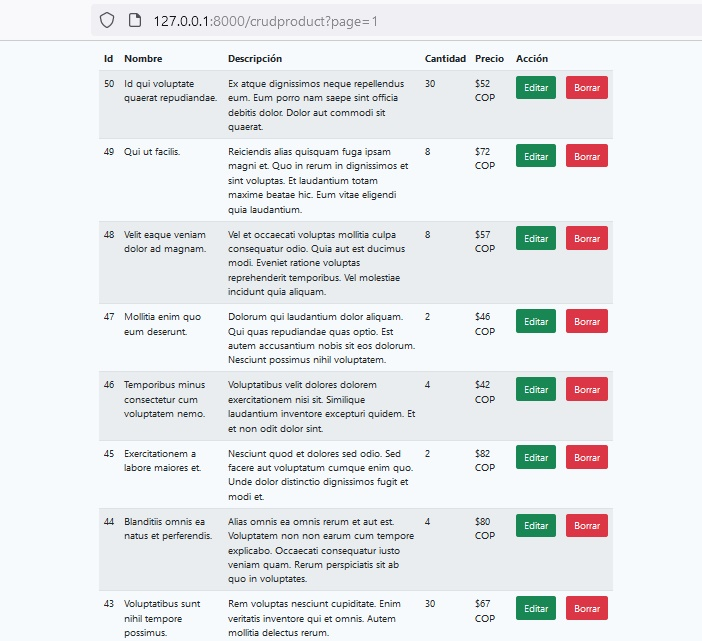

# Livewire sobre Laravel 8.x

Livewire es un framework fullstack para desarrollo de componentes dinámicos basados en PHP y con vistas en Blade, que son capaces de reaccionar reactivamente en el lado del cliente con Ajax a cambios en los datos. Livewire ofrece la posibilidad de realizar componentes con programación Javascript avanzada, pero sin necesidad de escribir código Javascript, o sea, del lado del cliente.



Por medio de **componentes Livewire** que puedes escribir con vistas de Blade, es posible conversar entre el cliente y el servidor de una manera sencilla y sin necesidad de recargar la página. Livewire permite realizar sitios web con una experiencia de usuario avanzada, similares a los que realizarías con sistemas como Vue o React solamente con programación en el lado del servidor.

## Instalar Livewire

Antes debes tener instalado Laravel, puedes instalar Laravel con Composer usando el siguiente comando:

```
composer create-project --prefer-dist laravel/laravel crudlivewire
```

Donde:

**crudlivewire**: Nombre de la carpeta donde residirá nuestro proyecto.

Si ya habías instalado Laravel de manera global entonces con el comando:

```
composer global require laravel/installer
```

Livewire requiere una versión de PHP 7.2 en adelante y una versión de Laravel 7.0 o superior.

## Modelo y migración

Creamos el modelo Eloquent que llamaremos **CrudProduct**, y para crearlo utilizamos la siguiente línea de comando:

```
php artisan make:model CrudProduct -mfc
```

Con la opción -mfc le decimos a Laravel que además de crear el modelo nos genere al mismo tiempo la definición de la migración, la factory y el controlador. Luego añade los campos que vamos a necesitar dentro del método **Schema::create** del archivo de migración *xxx_create_crud_products_table* que generó el sistema en la carpeta database/migrations:

```
/**
 * Run the migrations.
 *
 * @return void
 */
public function up()
{
    Schema::create('crud_products', function (Blueprint $table) {
		$table->id();
		$table->string('name'); 
		$table->string('description');
		$table->integer('quantity');
		$table->float('price');
		$table->text('user_id'); // user_id of our product author	
		$table->timestamps();
    });
}
```

Además editamos el modelo para añadir los campos **protected** _$table_ y _$fillable_ en el archivo del modelo que nos generó el sistema app/Models/CrudProduct.php

```
class CrudProduct extends Model
{
    use HasFactory;
	protected $table = 'crud_products';
	protected $fillable = ['name', 'description', 'quantity', 'price', 'user_id'];	
}
```

Dentro de la carpeta database/factories, editaremos el archivo CrudProductFactory.php. Dentro del método definition() en este archivo, editaremos la matriz de retorno para definir los datos que necesitamos para nuestra aplicación, debería verse como este:

```
namespace Database\Factories;

use App\Models\User;
use Illuminate\Database\Eloquent\Factories\Factory;

...

public function definition()
{
    return [
        //	
    'name' => $this->faker->sentence(4),
    'description' => $this->faker->text(),
    'quantity' => $this->faker->randomElement([2, 4, 8, 15, 30]),
    'price' => $this->faker->numberBetween(5, 100),
    'user_id' => User::factory() //Generates a User from factory
    ];
}
```

Ahora nos toca sembrar, o sea, añadir datos de muestra en la base de datos, para esto vamos a editar el archivo database/seeders/DataSeeder.php, añadiendo lo siguiente:

```
/**
 * Seed the application's database.
 *
 * @return void
 */
public function run()
{
    \App\Models\User::factory(10)->create();		
	\App\Models\CrudProduct::factory(50)->create();
}
```

Con lo cual le estamos diciendo al sistema que nos añada 50 productos de muestra y 10 usuarios.

Finalmente para que se generen los productos del factory desde la terminal ejecutamos las migraciones y el seed con el comando artisan:

```
php artisan migrate:fresh --seed
```

## Rutas

Ya hemos creado el controlador en el instante que creamos el modelo como vimos antes, ahora nos toca definir las rutas, editamos el archivo _routes/web.app_, comencemos con la ruta al método index del controlador, añadimos:

```
Route::get('/crudproduct', [\App\Http\Controllers\CrudProductController::class, 'index']);
```

## El componente Livewire

Primero editamos el archivo _App/Http/Controllers/CrudProductController.php_ añadiendo el método index que lo único que hará es devolver la vista _index.blade.php_:

```
public function index() {         
   return view('crudproduct.index');     
}
```

Lo siguiente es crear el componente, cuando creamos un componente livewire, automàticamente se crea la carpeta _App/Http/Livewire_ que va a contener un archivo php con la clase del componente. Esta clase solo va a renderizar la vista que le coresponde al componente que tambièn es generada por el sistema en _resources/views/livewire_ y que serà la que finalmente visualizarà el componente; sin embargo, es la vista _index.blade.php_ la que se va a encargar de ejecutar o mostrar al componente.

Para entendernos mejor y estar màs organizados, vamos antes a crear la carpeta _resources/views/crudproduct_ donde colocaremos las vistas que pertenecen a este modelo. Comencemos creando nuestra primera vista, el archivo _index.blade.php_ y luego vamos a modificarlo para llamar al componente.

Procedemos entonces ahora crear el componente, ejecutando el siguiente comando:

```
php artisan make:livewire CrudProductComponent
```

Donde,

**CrudProductComponent**: Es el nombre de  la clase de tipo Component.

Editemos la vista _index.blade.php_ para añadir:

```
@extends('layouts.app') 

@section('content') 
<div class="container">     
   @livewire('crud-product-component') 
</div> 
@endsection
```

Donde,

**crud-product-component**: Es la vista generada por el sistema al crear el componente.

Es momento de editar el nuevo componente en _App/Http/Livewiree/CrudProductComponent.php_.

El archivo anterior debe verse como este:

```
namespace App\Http\Livewire;

use Livewire\Component;
use App\Models\CrudProduct;
use Livewire\WithPagination;

class CrudProductComponent extends Component
{
use WithPagination;
	
    public function render()
    {
	 	$crudproducts = CrudProduct::orderBy('id', 'desc')->paginate(10);
        return view('livewire.crud-product-component', compact('crudproducts'));
    }
}
```

Ahora vamos a trabajar en la vista del componente _resources/views/livewire/crud-product-component.blade.php_.

La vista en cuestión debería verse así:

```
<div class="row">    
  <div class="col-md-8">        
    <div class="mt-2 table-responsive-md">            
      <table class="table table-striped">                
        <thead>                  
          <tr>                    
            <th scope="col">Id</th>                    
            <th scope="col">Nombre</th>                    
            <th scope="col">Descripción</th>                    
            <th scope="col">Cantidad</th>                    
            <th scope="col">Precio</th>                    
            <th scope="col">Acción</th>                    
            <th scope="col"></th>                  
            </tr>                
        </thead>                
        <tbody>                    
          @foreach ($crudproducts as $crudproduct)                        
            <tr>                            
              <td>{{ $crudproduct->id }}</td>                            
              <td>{{ $crudproduct->name }}</td>                            
              <td>{{ $crudproduct->description }}</td>                            
              <td>{{ $crudproduct->quantity }}</td>                            
              <td>${{ $crudproduct->price }} COP</td>                            
              <td>                                
                <button type="button" class="btn btn-success">Editar</button>                            
              </td>                            
              <td>                                
                <button type="button" class="btn btn-danger">Borrar</button>                            
              </td>                        
            </tr>                    
          @endforeach                
        </tbody>            
       </table>             
       {{ $crudproducts->links('pagination::Bootstrap-4') }}        
     </div>    
   </div>    
  <div class="col-md-4"></div> 
</div>
```

Antes de probar la aplicación no olvidar añadir en el archivo layout _app.blade.php_ los styles y scripts bootstrap necesarios. Además agregue los scripts livewire que deben estar presente en cada página que utilice este paquete, los cuales son añadidos en este layout con la siguiente estructura general.

```
</html>
	<head>
	
  		...
	
  		@livewireStyles
	</head>

	<body>
	
  		...
  
  		@livewireScripts
	</body>
</html>
```

